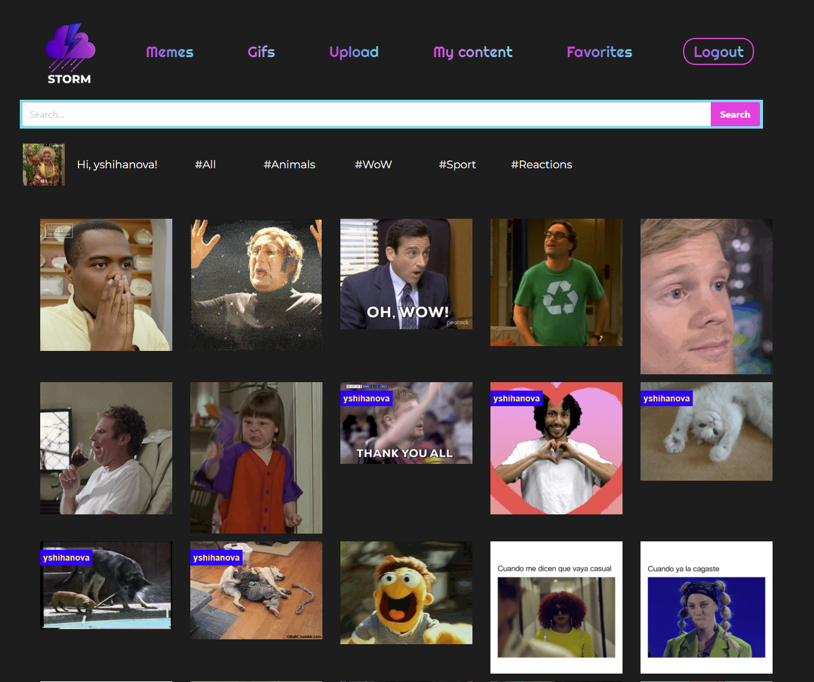
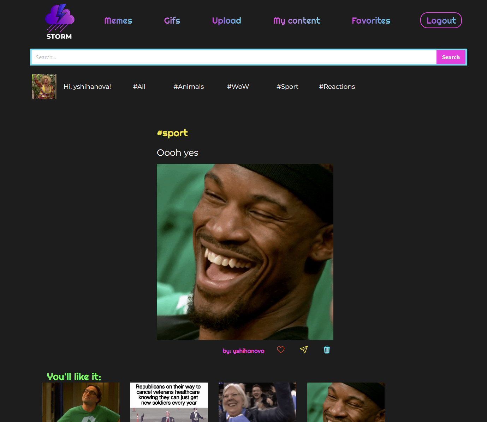
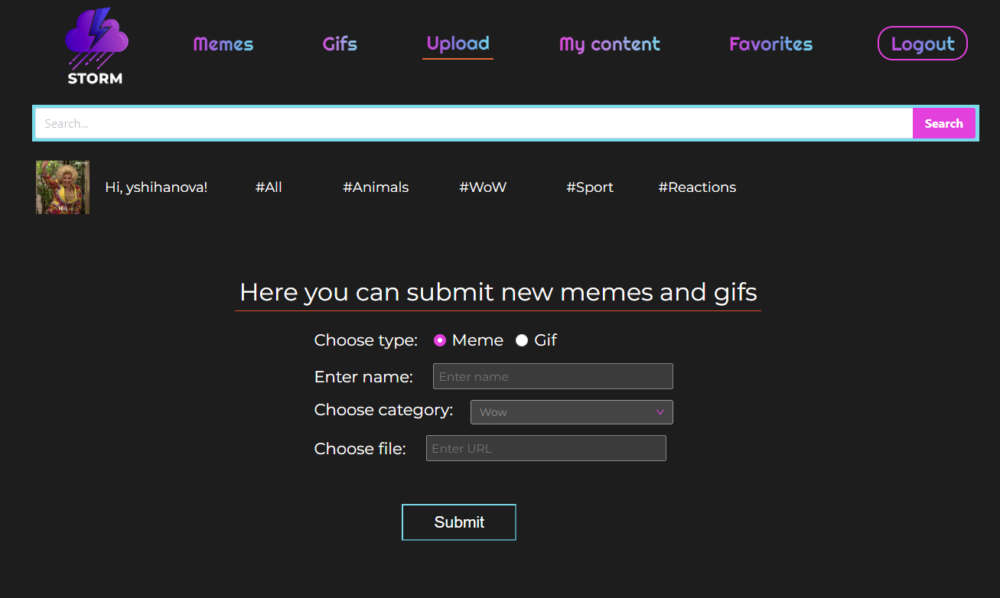
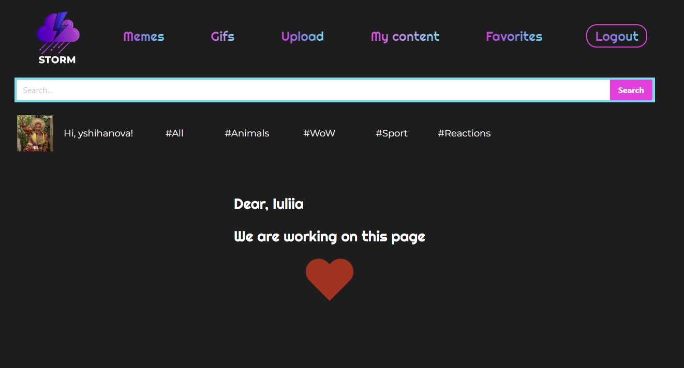
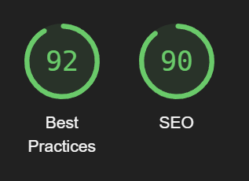

# Frontend Project: GIFS STORM 
**GIFs and Memes Website**

Welcome to the Frontend project README for our GIFs and Memes website! In this document, you will find all the necessary information to understand the project, set up the development environment, and run the application successfully.

This is a MERN Web-first progect.

## Project Description
Our GIFs and Memes website is a platform where users can browse, share, and upload their own GIFs and Memes. The application is built using React, a widely-used JavaScript library for building user interfaces.

## Key features of the application:

- GIFs and Memes Viewing: Users can explore a vast collection of popular GIFs and Memes.
- Content Upload: Users can upload their own GIFs and Memes to share them with the community.
- Filtering by Categories and Groups: Users can filter GIFs and Memes based on different categories and groups to find specific content.
- Intuitive User Interface: The application offers a user-friendly and easy-to-use interface for an enjoyable user experience.

## System Requirements
To run the application in your local environment, make sure you have the following installed:

**Node.js** (version 12 or higher)
**NPM** (Node Package Manager) or Yarn

## Environment Setup
Follow the steps below to set up the development environment:

1. Clone the project repository from GitHub: git clone **https://github.com/IuliiaNova/git-storm-react.git**
2. Navigate to the project's root directory: cd <DIRECTORY_NAME>
3. Install the project dependencies using NPM or Yarn: ``npm install or yarn install``
4. Running the Application ``npm run dev`` or config it in your package.json

The development server will start, and the application will be available in your browser at http://localhost:5173 (or other, check it in your terminal)

## Project Structure
The project follows a standard folder and file structure for a React application. Below is a description of the most important directories:

**src**: Contains the main source code of the application.
components: Contains reusable components used in different parts of the application.
**pages**: Contains the main pages of the application.

### Libraries 
+ "antd"
+ "react-helmet-async"
+ "react-icons"
+ "react-spinners"
+ auth0 

## Visualization 

**Home Page**

**Item Page**

**Upload Page**

**Coming soon Page**

**Lighthouse**

### Contact
If you have any questions or inquiries related to the project, feel free to contact us via the following email address: **yshihanova@gmail.com**

## Author ✨
<table>
  <td align="center">
    <a href="https://github.com/IuliiaNova">
      
       
      
      <b>Iuliia Shikhanova</b>
      
    </a>
     
    <a href="#code-luliianova" title="code-tools-maintenance-design">💻🔧🚧🎨</a>
  </td>
  </tr>
  </table>

